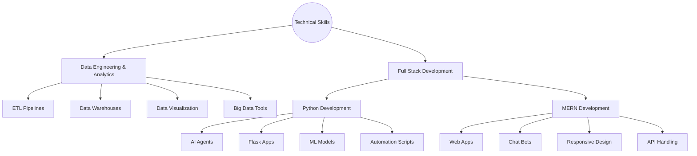

<br>
<a href="https://git.io/typing-svg"></a>

<!--  -->
---
🕵️ About Me

</img>

```python
class PratikMandalkar:
    def __init__(self):
        self.role = "Software Developer & Data Enthusiast"
        self.education = "B.Tech in IT @ VIT Pune"
        self.interests = ["Data Engineering","Web Development","AIML"]
        
    def say_hi(self):
        print("Let's build something amazing together! 🚀")

```

 


<!-- <h1 align="center">LeetCode Info<h1>  
<p align="center">
  <a href="https://leetcode.com/u/its-pratik21/" target="_blank"></a>
  <a href="https://leetcode.com/u/its-pratik21/" target="_blank"></a>
  <a href="https://leetcode.com/u/its-pratik21/" target="_blank"></a>
  <a href="https://github.com/its-pratik21" target="_blank">
    
  </a> -->
<!--   <a href="https://github.com/its-pratik21" target="_blank">
    
  </a> -->
<!-- </p>
<p align="center">
    
</p> -->


<h1 align="center">Technical Skills</h1>
<p align="center">
  <a href="https://skillicons.dev">
    
  </a>
</p>
<p align="center">
  <a href="https://skillicons.dev">
    
  </a>
</p>
<p align="center">
  <a href="https://skillicons.dev">
    
  </a>
</p>


<h3 align="left">My Contributions :</h3>

</div>

---

<h1 align="center">⚡ Current Stats ⚡</h1>
<div align="center">
  
</div>

</p> -->

---

## 🧭 Current Navigation



---

## 📫 Let's Connect!

<div align="center">
  <p>💡 Open for collaborations and interesting projects!</p>
  <p>🌟 Let's build something amazing together!</p>
</div>

<div align="center">
  
</div>

---
